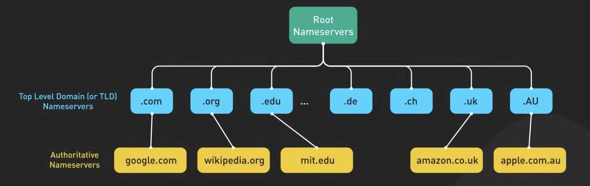
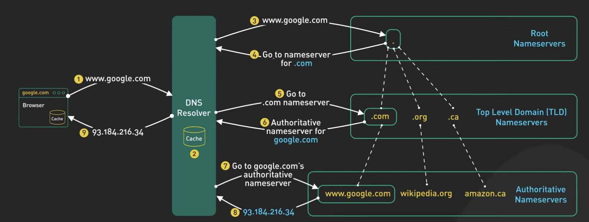

+++
date = '2024-10-10T10:00:00+07:00'
draft = false
title = 'Hệ thống DNS: Thiết kế và Hoạt động'
summary = 'DNS (Domain Name System) là xương sống của internet, nó dịch các tên miền mà con người có thể đọc được, chẳng hạn như google.com, thành các địa chỉ IP mà máy tính có thể hiểu được.'
tags = ['dns', 'networking', 'internet']
categories = []
+++

DNS (Domain Name System) là xương sống của internet, nó dịch các tên miền mà con người có thể đọc được, chẳng hạn như google.com, thành các địa chỉ IP mà máy tính có thể hiểu được.

DNS có thể gây nhầm lẫn vì có nhiều loại máy chủ DNS khác nhau trong hệ thống phân cấp DNS, mỗi loại phục vụ một mục đích khác nhau.

## Cách thức hoạt động của DNS

Khi trình duyệt thực hiện một truy vấn DNS, nó đang hỏi một DNS resolver. DNS resolver này có thể đến từ ISP của chúng ta, hoặc từ các nhà cung cấp DNS phổ biến như Cloudflare (1.1.1.1) hoặc Google (8.8.8.8).

Nếu DNS resolver không có câu trả lời trong bộ nhớ cache của nó, nó sẽ tìm máy chủ tên có thẩm quyền phù hợp và hỏi nó. Máy chủ tên có thẩm quyền là máy chủ giữ câu trả lời.

Khi chúng ta cập nhật bản ghi DNS của một tên miền, chúng ta đang cập nhật máy chủ tên có thẩm quyền của nó.

## Hệ thống phân cấp DNS

Làm thế nào để DNS resolver tìm thấy máy chủ tên có thẩm quyền? Đây là nơi hệ thống DNS trở nên thú vị.

Có ba cấp độ chính của máy chủ DNS có thẩm quyền:

### 1. Root Name Servers (Máy chủ tên gốc)

- Lưu trữ địa chỉ IP của các máy chủ tên TLD
- Có 13 máy chủ tên gốc logic
- Mỗi máy chủ tên gốc có một địa chỉ IP duy nhất được gán cho nó
- Thực tế có nhiều máy chủ vật lý đằng sau mỗi địa chỉ IP
- Thông qua anycast, chúng ta được định tuyến đến máy chủ gần nhất

### 2. TLD Name Servers (Máy chủ tên miền cấp cao)

- Lưu trữ địa chỉ IP của các máy chủ tên có thẩm quyền cho tất cả các tên miền dưới chúng
- Có nhiều loại tên TLD khác nhau:
  - Các TLD phổ biến: .com, .org, .edu
  - Các TLD mã quốc gia: .de, .uk
  - Và nhiều loại khác

### 3. Authoritative Name Servers (Máy chủ tên có thẩm quyền)

- Cung cấp câu trả lời có thẩm quyền cho các truy vấn DNS
- Khi chúng ta đăng ký một tên miền, nhà đăng ký sẽ chạy các máy chủ tên có thẩm quyền theo mặc định
- Chúng ta có thể thay đổi chúng thành các máy chủ khác
- Các nhà cung cấp đám mây như AWS và Cloudflare chạy các máy chủ tên có thẩm quyền mạnh mẽ

Thiết kế phân cấp này làm cho DNS có tính phi tập trung cao và mạnh mẽ.

## Vòng đời của một truy vấn DNS

Hãy cùng theo dõi vòng đời của một truy vấn DNS điển hình:

1. **Người dùng nhập google.com vào trình duyệt**

2. **Trình duyệt kiểm tra cache của nó trước**

3. **Nếu không có câu trả lời, nó thực hiện lệnh gọi hệ điều hành để cố gắng lấy câu trả lời**

4. **Lệnh gọi hệ điều hành có thể có cache riêng của nó**

5. **Nếu câu trả lời không có ở đó, nó liên hệ với DNS resolver**

6. **DNS resolver kiểm tra cache của nó trước**

7. **Nếu không có hoặc câu trả lời đã hết hạn, nó hỏi máy chủ tên gốc**

8. **Máy chủ tên gốc phản hồi với danh sách các máy chủ tên TLD .com**

9. **DNS resolver sau đó liên hệ với máy chủ tên TLD .com**
   - Lưu ý: Vì .com là TLD phổ biến, resolver có thể đã cache địa chỉ IP của các máy chủ tên TLD .com

10. **Máy chủ tên TLD .com trả về các máy chủ tên có thẩm quyền cho google.com**

11. **Cuối cùng, DNS resolver liên hệ với máy chủ tên có thẩm quyền của google.com**

12. **Nó trả về địa chỉ IP của google.com**

13. **DNS resolver sau đó trả về địa chỉ IP cho hệ điều hành**

14. **Hệ điều hành trả về nó cho trình duyệt**

## Những lưu ý khi cập nhật DNS cho hệ thống production

Khi cập nhật bản ghi DNS cho một hệ thống production có lưu lượng truy cập cao, có một số điều cần lưu ý:

### Vấn đề với DNS Propagation

DNS propagation chậm vì có TTL (Time To Live) trên mỗi bản ghi DNS. Một số TTL mặc định khá dài. Ngoài ra, không phải mọi DNS resolver đều là "công dân tốt" - có một số resolver không tuân thủ TTL.

### Các bước thực tế để giảm thiểu rủi ro

Để giảm thiểu rủi ro, có hai bước thực tế cần thực hiện:

#### 1. Giảm TTL trước khi thay đổi

Đầu tiên, giảm TTL cho bản ghi mà chúng ta muốn thay đổi xuống một giá trị rất ngắn, chẳng hạn như 60 giây, trước khi thực hiện cập nhật thực tế.

Điều này cho phép tất cả các máy chủ DNS có đủ thời gian để nhận TTL được rút ngắn, từ đó cho phép việc cập nhật bản ghi thực tế có hiệu lực dựa trên TTL mới được rút ngắn.

#### 2. Giữ máy chủ cũ chạy

Thứ hai, để máy chủ chạy trên địa chỉ IP cũ trong một thời gian. Chỉ ngừng hoạt động máy chủ khi lưu lượng truy cập giảm xuống mức có thể chấp nhận được.

Vì một số DNS resolver không tuân thủ TTL, điều này có thể mất một chút thời gian và sự kiên nhẫn.

## Kết luận

DNS là thành phần quan trọng của xương sống internet. Thiết kế phân cấp của nó làm cho nó trở nên phi tập trung và mạnh mẽ. 

Hãy nhớ rằng, DNS là thứ dịch tên miền thành địa chỉ IP, làm cho nó trở thành một thành phần quan trọng của xương sống internet.

Hiểu rõ cách DNS hoạt động sẽ giúp bạn thiết kế và vận hành các hệ thống phân tán tốt hơn, đặc biệt khi cần thực hiện các thay đổi DNS trong môi trường production.
