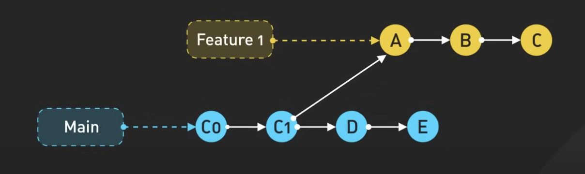
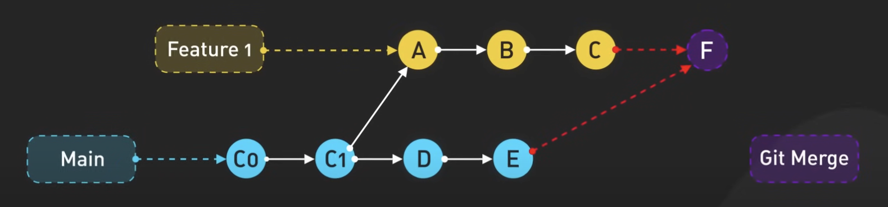
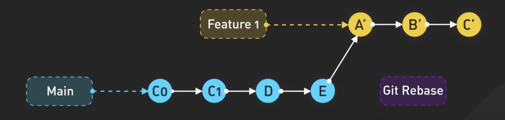
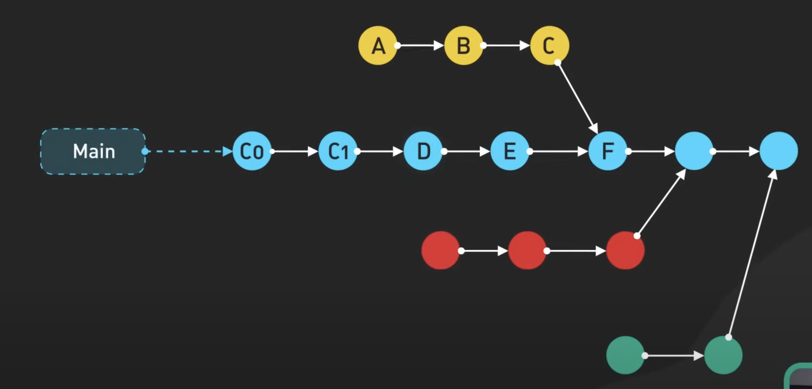
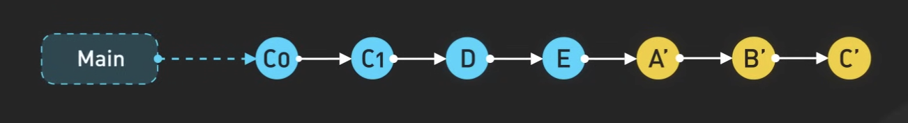
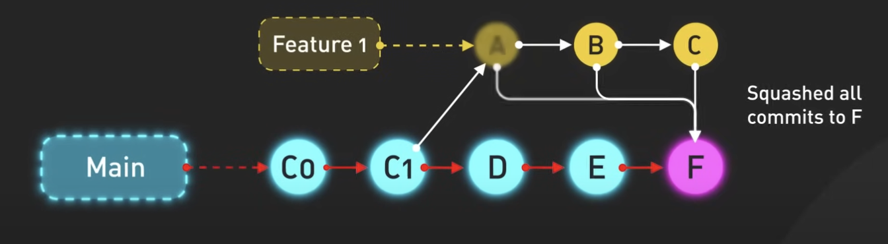

+++
date = '2022-12-17T10:43:32+07:00'
draft = false
title = 'Git merge vs rebase'
summary = 'Nếu bạn từng làm việc trên một dự án Git có nhiều branch, có lẽ bạn đã từng phải tìm cách đưa các thay đổi từ feature branch về lại main branch, hoặc giữ cho feature branch luôn được cập nhật từ main branch. Giờ nên xài `git merge`, `git rebase` hay `squash commit`?'
tags = ['git']
categories = []
+++

Nếu bạn từng làm việc trên một dự án Git có nhiều branch, có lẽ bạn đã từng phải tìm cách đưa các thay đổi từ feature branch về lại main branch, hoặc giữ cho feature branch luôn được cập nhật từ main branch. Câu hỏi lớn đặt ra là: chúng ta nên dùng `git merge`, `git rebase`, hay nên `squash commit`?

Giả sử chúng ta vừa tạo một feature branch mới từ main. Trên branch này, chúng ta đã thêm các commit A, B và C. Cùng lúc đó, main cũng có thêm các commit D và E.

Giữ cho feature branch luôn được cập nhật từ main là một phần quan trọng trong quy trình làm việc với Git. Chúng ta có thể thực hiện điều này bằng cách dùng `git merge` hoặc `git rebase`.

- `git merge` sẽ lấy các thay đổi mới nhất từ main và đưa vào feature branch, đồng thời tạo ra một `merge commit` mới trong quá trình này.

- Còn `git rebase` thì sẽ thay đổi điểm gốc (base) của feature branch thành commit mới nhất trên main, đồng thời sửa lại các commit trên feature branch từ điểm gốc mới đó. Nó cho ta một lịch sử commit đẹp và thẳng. Nhiều người rất thích điều này.

Bây giờ, khi chúng ta đã hoàn thành việc phát triển tính năng, bước tiếp theo là đưa feature branch trở lại main. Chúng ta có một vài lựa chọn để làm điều này:
- `git merge`: Nó sẽ tạo ra một `merge commit` mới để kết nối lịch sử của cả hai branch lại với nhau. Tuy nhiên, nếu chúng ta làm việc này thường xuyên, sẽ có rất nhiều `merge commit` được tạo ra, và điều đó có thể khiến lịch sử commit trở nên hơi rối rắm. 

- `git rebase và fast-forward merge`: chúng ta có thể dùng `git rebase` để chuyển các thay đổi của feature branch lên đầu main branch, rồi thực hiện một `fast-forward merge`. Làm cách này sẽ giúp lịch sử commit đẹp hơn. `fast-forward merge` thực chất vẫn là dùng lệnh `git merge`, nhưng Git sẽ không tạo ra `merge commit` vì nó thấy rằng branch hiện tại (main) là gốc trực tiếp của branch được merge vào (feature branch).

- `squash commit`: gộp tất cả các commit của feature branch thành một commit duy nhất rồi merge commit đó vào main. Cách này giúp lịch sử commit được tuyến tính như rebase nhưng vẫn tạo ra một merge commit. Tuy nhiên sẽ mất đi chi tiết các commit riêng lẻ đã thực hiện trước đó trong lịch sử commit của main. Squash commit là cách khá phổ biến trên các nền tảng như GitHub vì nó cho phép ta dọn dẹp lịch sử commit trên main nhưng vẫn giữ được chi tiết lịch sử commit trên feature branch.

