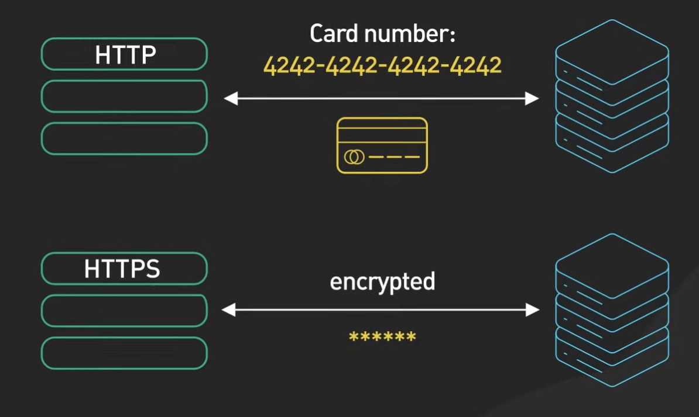
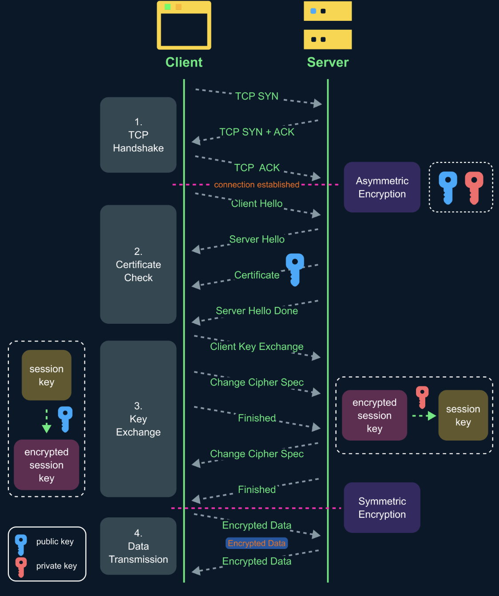

# HTTPS Hoạt Động Như Thế Nào?

Ngày nay, hầu hết các website đều yêu cầu HTTPS. Vậy HTTPS hoạt động như thế nào? Chúng ta sẽ trả lời câu hỏi này trong bài viết này.

## Vấn Đề Với HTTP Thông Thường

Không có HTTPS, việc giao tiếp giữa trình duyệt và server diễn ra dưới dạng văn bản thuần túy. Điều này có nghĩa là mật khẩu bạn nhập hoặc số thẻ tín dụng bạn gửi qua internet có thể được đọc bởi bất kỳ ai có khả năng chặn nó.

## HTTPS Là Gì?

HTTPS được thiết kế để giải quyết vấn đề này - làm cho dữ liệu được gửi qua Internet không thể đọc được bởi bất kỳ ai khác ngoài người gửi và người nhận.

HTTPS là một phần mở rộng của giao thức HTTP. Với HTTPS, dữ liệu được gửi dưới dạng mã hóa bằng cách sử dụng một thứ gọi là TLS. TLS là viết tắt của Transport Layer Security (Bảo mật tầng vận chuyển).

Nếu dữ liệu được mã hóa bị hacker chặn, tất cả những gì họ có thể thấy chỉ là dữ liệu rối loạn.

## HTTPS = HTTP + TLS

Điều quan trọng cần hiểu là HTTPS thực chất chỉ là HTTP chạy trên nền tảng TLS. TLS hoạt động như một lớp bảo mật nằm giữa tầng ứng dụng (HTTP) và tầng vận chuyển (TCP).

Mô hình này không chỉ áp dụng cho HTTP mà còn cho nhiều giao thức khác:

- **FTP và FTPS**: File Transfer Protocol thông thường (FTP) truyền dữ liệu dưới dạng văn bản thuần túy, trong khi FTPS (FTP over TLS/SSL) mã hóa toàn bộ quá trình truyền file
- **SMTP và SMTPS**: Simple Mail Transfer Protocol dùng để gửi email, SMTPS là phiên bản bảo mật với TLS
- **RTMP và RTMPS**: Real-Time Messaging Protocol dùng cho streaming video, RTMPS là phiên bản mã hóa
- **LDAP và LDAPS**: Lightweight Directory Access Protocol dùng để truy cập thông tin thư mục, LDAPS là phiên bản an toàn

Nguyên tắc chung là: **Giao thức gốc + TLS = Phiên bản bảo mật**. TLS cung cấp ba tính năng chính:
1. **Mã hóa**: Dữ liệu không thể đọc được nếu bị chặn
2. **Xác thực**: Đảm bảo bạn đang giao tiếp với đúng server
3. **Toàn vẹn**: Dữ liệu không bị thay đổi trong quá trình truyền

## Cách Thức Hoạt Động Của TLS Handshake

Hãy xem xét cách thức hoạt động của TLS handshake. Có một số bước:

### Bước 1: Thiết Lập Kết Nối TCP

Giống như trong trường hợp HTTP, trình duyệt thiết lập kết nối TCP với server.

### Bước 2: Client Hello

Đây là nơi TLS handshake bắt đầu. Trình duyệt gửi một thông điệp "client hello" đến server. Trong thông điệp Hello này, trình duyệt thông báo cho server những điều sau:

1. **Phiên bản TLS** mà nó có thể hỗ trợ - có thể là TLS 1.2, TLS 1.3, v.v.
2. **Cipher Suite** mà nó hỗ trợ - Cipher Suite là một tập hợp các thuật toán mã hóa được sử dụng để mã hóa dữ liệu.

### Bước 3: Server Hello và Certificate

Sau khi nhận được client hello, server được chọn Cipher Suite và phiên bản TLS để sử dụng dựa trên các tùy chọn mà nó nhận được từ client. Nó gửi những thông tin này trong thông điệp "server hello" trở lại cho client.

Máy chủ sau đó gửi certificate (chứng chỉ) cho client. Certificate bao gồm nhiều thứ khác nhau, một trong những điều quan trọng là public key (khóa công khai) của server.

Trước khi sử dụng certificate, client phải kiểm tra xem certificate này có đáng tin cậy hay không. **Bước này cực kỳ quan trọng** vì nếu bỏ qua, hệ thống sẽ dễ bị tấn công Man-in-the-Middle (MITM).

**Nguy Cơ MITM (Man in the Middle) Attack Khi Không Kiểm Tra Certificate**

Nếu client không xác minh certificate của server, kẻ tấn công có thể thực hiện MITM attack như sau:

1. **Kẻ tấn công đặt mình ở giữa**: Hacker định vị mình giữa client và server thật (ví dụ: qua WiFi công cộng không an toàn)

2. **Tạo certificate giả**: Kẻ tấn công tạo certificate giả mạo cho website đích và gửi cho client

3. **Client chấp nhận certificate giả**: Nếu không kiểm tra, client sẽ thiết lập kết nối TLS với kẻ tấn công thay vì server thật

4. **Kẻ tấn công trở thành "proxy"**:
   - Client gửi dữ liệu mã hóa cho kẻ tấn công (tưởng là server thật)
   - Kẻ tấn công giải mã, đọc/sửa đổi dữ liệu, rồi mã hóa lại gửi cho server thật
   - Server thật phản hồi, kẻ tấn công lại giải mã, đọc/sửa, rồi gửi về client

5. **Hậu quả**: Kẻ tấn công có thể đọc mọi thông tin nhạy cảm (mật khẩu, thẻ tín dụng) và thậm chí sửa đổi nội dung website

Đây chính là lý do tại sao việc kiểm tra certificate là bước không thể thiếu trong HTTPS. Quá trình kiểm tra bao gồm:

1. **Kiểm tra Certificate Authority (CA)**: Client xác minh rằng certificate được ký bởi một Certificate Authority đáng tin cậy thông qua chuỗi tin cậy (chain of trust):
   - **Root CA**: Trình duyệt có sẵn danh sách các Root CA đáng tin cậy được cài đặt từ trước (như Let's Encrypt, DigiCert, Comodo)
   - **Intermediate CA**: Certificate của website thường được ký bởi Intermediate CA, không phải trực tiếp bởi Root CA
   - **Xác minh chữ ký số**: Client sử dụng public key của CA để xác minh chữ ký số trên certificate của website
   - **Chuỗi xác thực**: Client theo dõi chuỗi từ certificate của website → Intermediate CA → Root CA để đảm bảo tính hợp lệ

2. **Kiểm tra tên miền**: Client đảm bảo rằng tên miền trong certificate khớp với tên miền của website mà nó đang truy cập.

3. **Kiểm tra thời hạn**: Client xác minh rằng certificate chưa hết hạn và đã có hiệu lực.

Nếu bất kỳ bước kiểm tra nào thất bại, trình duyệt sẽ hiển thị cảnh báo bảo mật cho người dùng.

Client sử dụng public key trong một thứ gọi là mã hóa bất đối xứng (asymmetric encryption). Trong mã hóa bất đối xứng, một phần dữ liệu được mã hóa bằng public key chỉ có thể được giải mã bằng private key (khóa riêng tư).

Điều này kết thúc bước hai - giai đoạn hello của TLS handshake. Tại thời điểm này, client có certificate của server, và client và server đã thống nhất về phiên bản TLS và Cipher Suite để sử dụng.

### Bước 4: Trao Đổi Khóa

Bây giờ đến bước ba - đây là bước mà client và server đưa ra một khóa mã hóa chung để sử dụng để mã hóa dữ liệu.

Và đây là nơi mã hóa bất đối xứng lại xuất hiện. Với mã hóa bất đối xứng, dữ liệu được mã hóa ở phía client bằng public key từ server chỉ có thể được giải mã bởi server. Đây là cách client gửi khóa mã hóa một cách an toàn đến server qua internet rộng mở.

Tất cả điều này được thực hiện trong thông điệp "client key exchange". Chi tiết chính xác thay đổi tùy thuộc vào Cipher Suite được sử dụng. Ở đây chúng ta sử dụng RSA làm ví dụ vì nó dễ hiểu nhất. Với RSA, client tạo ra một khóa mã hóa (còn gọi là session key), mã hóa nó bằng public key của server, và gửi session key đã mã hóa đến server qua Internet.

Máy chủ nhận session key đã mã hóa và giải mã nó bằng private key của mình. Bây giờ cả hai bên đều giữ session key.

### Bước 5: Giao Tiếp Mã Hóa

Đây là bước cuối cùng của TLS handshake. Bây giờ, client và server có thể sử dụng session key và Cipher Suite đã thống nhất để gửi dữ liệu mã hóa qua lại trong một kênh hai chiều an toàn.

## Tại Sao Không Chỉ Sử Dụng Mã Hóa Bất Đối Xứng?

Bây giờ bạn có thể hỏi tại sao chúng ta không chỉ sử dụng mã hóa bất đối xứng cho mọi thứ? Tại sao lại chuyển sang mã hóa đối xứng?

Lý do chính là mã hóa bất đối xứng tốn kém về mặt tính toán. Nó không thực sự phù hợp cho việc truyền dữ liệu số lượng lớn.

## RSA vs Diffie-Hellman

Trong ví dụ của tôi sử dụng RSA cho mã hóa bất đối xứng để trao đổi session key đối xứng một cách an toàn. Một lần nữa, tôi chọn RSA vì nó dễ hiểu.

Tuy nhiên, mã hóa bất đối xứng không phải là cách duy nhất để chia sẻ session key giữa client và server. Thực tế, trong TLS 1.3, RSA không còn được hỗ trợ như một phương pháp trao đổi khóa.

Diffie-Hellman là cách phổ biến hơn ngày nay để trao đổi session key. Diffie-Hellman phức tạp, nhưng tóm lại, nó sử dụng một số toán học nâng cao liên quan đến các số nguyên tố lớn để tạo ra một session key chung mà không bao giờ truyền public key qua mạng.
