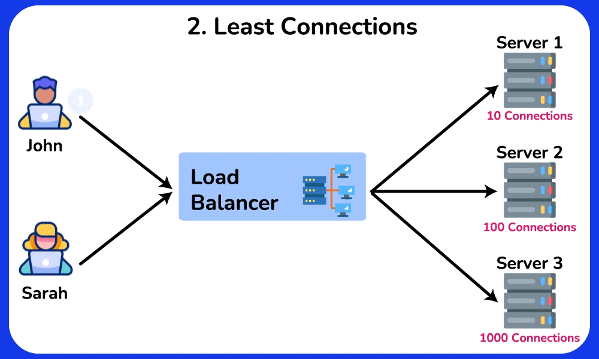
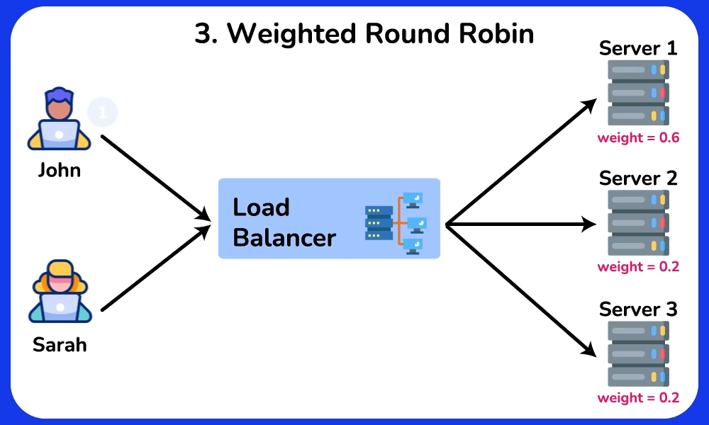
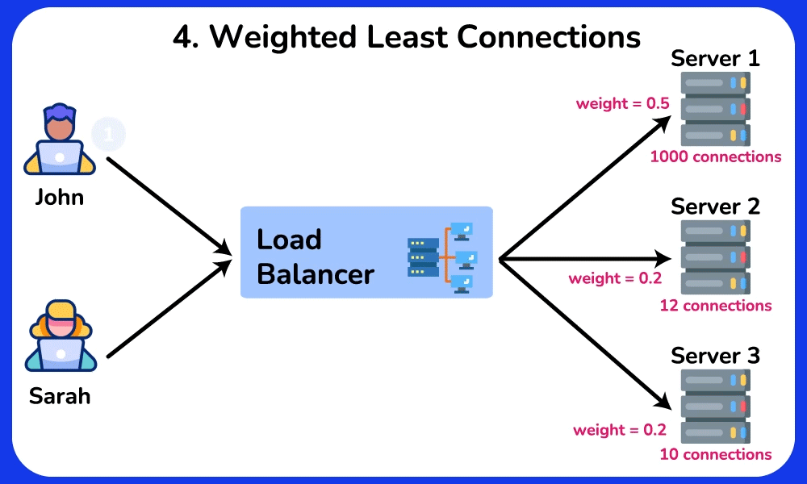
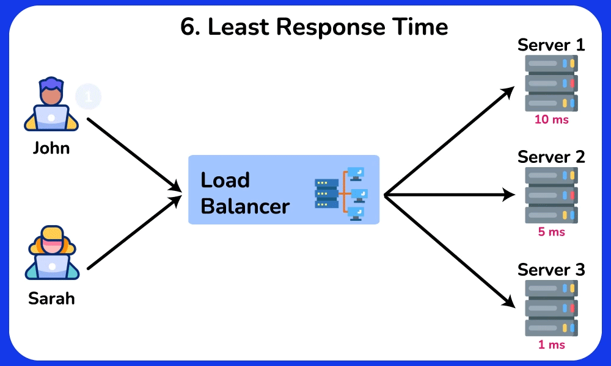
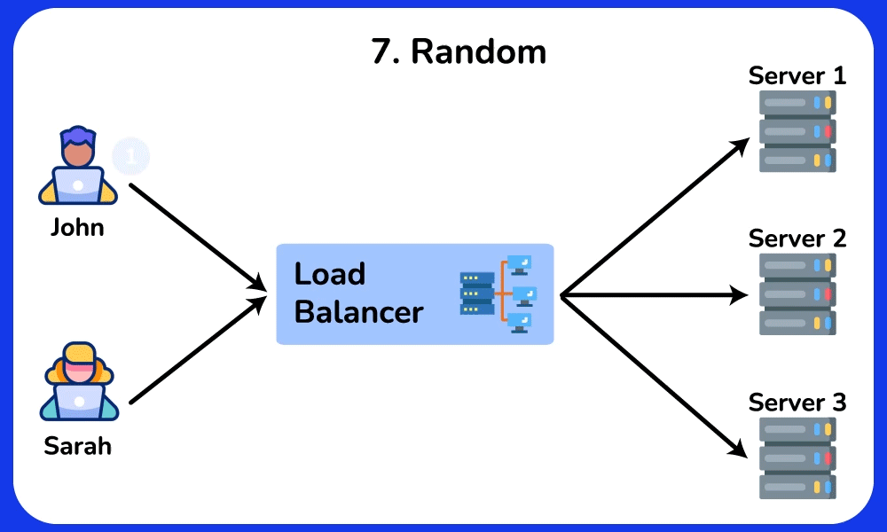

+++
date = '2023-03-04T09:47:31+07:00'
draft = false
title = 'Load Balancer'
summary = 'Trong thế giới hệ thống phân tán và ứng dụng web hiện đại, **Load Balancer (bộ cân bằng tải)** là một trong những thành phần quan trọng nhất. Nó giúp hệ thống đảm bảo **tính khả dụng cao (high availability)**, **hiệu suất tối ưu (performance)** và **khả năng mở rộng (scalability)**.'
tags = ['load balancer']
categories = []
+++

## 1. Load Balancer là gì?
Load Balancer là một thành phần đứng giữa client và server, có nhiệm vụ phân phối các request từ client đến nhiều server backend.

Ví dụ, khi bạn có một website chạy trên nhiều máy chủ khác nhau, load balancer sẽ điều phối yêu cầu của người dùng sao cho:

- Không có máy chủ nào bị quá tải
- Nếu một máy chủ hỏng, lưu lượng sẽ được điều hướng sang máy khác
- Người dùng vẫn thấy hệ thống hoạt động ổn định, không bị gián đoạn

Một số lý do chính khiến load balancer trở thành "must-have" trong kiến trúc hệ thống:

- 🚦 **Tránh quá tải**: Phân chia tải đều giữa các server.
- 💡 **Tăng hiệu suất**: Giúp phản hồi nhanh hơn bằng cách chọn server ít bận nhất.
- 🔄 **Tính sẵn sàng cao (HA)**: Nếu một server chết, lưu lượng sẽ chuyển sang server khác.
- 🔒 **Bảo mật**: Ẩn thông tin server nội bộ, chỉ expose load balancer ra ngoài.
- 📈 **Khả năng mở rộng**: Thêm hoặc bớt server backend mà không ảnh hưởng đến người dùng.

## 2. Load Balancer Layer 4 vs Layer 7
Load Balancer (LB) có thể hoạt động ở nhiều tầng khác nhau trong mô hình OSI, phổ biến nhất là **Layer 4 (Transport Layer)** và **Layer 7 (Application Layer)**. Chúng khác nhau ở mức độ thông tin mà LB sử dụng để đưa ra quyết định phân phối request.

### 2.1. Layer 4 Load Balancer (Transport Layer)
Cách hoạt động:
- Dựa vào thông tin **IP source/destination** và **TCP/UDP port**.
- LB không “đọc” nội dung gói tin ở tầng ứng dụng (HTTP headers, body, query string, v.v.).
- Thường thực hiện **TCP/UDP connection forwarding** (chuyển tiếp kết nối).

Ưu điểm:
- Hiệu năng cao, độ trễ thấp do chỉ xử lý metadata ở transport layer.
- Đơn giản, nhẹ.
- Thích hợp cho các giao thức không phải HTTP (VD: SMTP, FTP, RTMP, gRPC qua HTTP/2).

Nhược điểm:
- Không hiểu logic ứng dụng (không thể route theo URL, header, cookie).
- Khó triển khai các chính sách nâng cao như A/B testing, canary release.

Ví dụ: HAProxy (chế độ TCP), Nginx Stream, AWS NLB.

### 2.2. Layer 7 Load Balancer (Application Layer)
Cách hoạt động:
- Hiểu được giao thức ứng dụng (HTTP, HTTPS, gRPC, WebSocket, v.v.).
- Có thể đọc và phân tích **header, cookie, query string, URL path** để quyết định routing.

Ưu điểm:
- Cho phép routing linh hoạt:
  - /api/v1/* → backend A
  - /static/* → backend B
- Hỗ trợ caching, compression, authentication, SSL termination.
- Hữu ích cho microservices và kiến trúc hiện đại.

Nhược điểm:
- Nặng hơn, tốn CPU và RAM do phải xử lý request ở mức ứng dụng.
- Độ trễ có thể cao hơn layer 4.

Ví dụ: Nginx (HTTP reverse proxy), HAProxy (HTTP mode), AWS ALB, Traefik, Envoy.

## 3. Thuật Toán Cân Bằng Tải (Load Balancing Algorithms)

**Thuật toán cân bằng tải** là phương pháp mà load balancer sử dụng để phân phối lưu lượng truy cập và các yêu cầu đến nhiều máy chủ hoặc tài nguyên khác nhau.  
Mục tiêu chính của nó là đảm bảo sử dụng hiệu quả tài nguyên, cải thiện hiệu năng hệ thống, và duy trì tính sẵn sàng cao cũng như độ tin cậy.

Thuật toán cân bằng tải giúp ngăn chặn tình trạng một máy chủ bị quá tải dẫn đến giảm hiệu năng hoặc hỏng hóc.  
Bằng cách phân phối khối lượng công việc, các thuật toán này tối ưu hóa thời gian phản hồi, tối đa hóa thông lượng và nâng cao trải nghiệm người dùng.  

Các yếu tố có thể được xem xét:  
- Năng lực xử lý của server  
- Số kết nối đang hoạt động  
- Thời gian phản hồi  
- Tình trạng sức khỏe server  

Dưới đây là các thuật toán cân bằng tải nổi tiếng:

### 3.1. Round Robin

Phân phối yêu cầu đến các server theo vòng lặp tuần tự. Sau khi đến server cuối thì quay lại server đầu.

Ưu điểm
- Phân phối đồng đều, dễ triển khai, dễ hiểu.  
- Phù hợp khi các server có năng lực giống nhau.  

Nhược điểm
- Không nhận biết tải thực tế của server.  
- Không có "session affinity".  
- Hiệu năng kém nếu server khác nhau về cấu hình.  
- Mẫu phân phối dễ đoán, có thể bị khai thác.  

Trường hợp sử dụng
- Môi trường đồng nhất.  
- Ứng dụng **stateless**.  

### 3.2. Least Connections

Phân phối yêu cầu đến server có ít kết nối đang hoạt động nhất tại thời điểm đó.

Ưu điểm
- Nhận biết tải theo số kết nối.  
- Phân phối động, thích ứng với tải thay đổi.  
- Hiệu quả trong môi trường không đồng nhất.  

Nhược điểm
- Phức tạp hơn Round Robin.  
- Cần duy trì trạng thái kết nối.  
- Dễ xuất hiện "spike" khi kết nối ngắn hạn.  

Trường hợp sử dụng
- Môi trường không đồng nhất.  
- Ứng dụng có traffic biến động.  
- Ứng dụng **stateful**.  

### 3.3. Weighted Round Robin (WRR)

Cải tiến của Round Robin, gán trọng số cho server dựa trên năng lực xử lý. Server mạnh hơn nhận nhiều yêu cầu hơn.

Ưu điểm
- Phân phối theo năng lực.  
- Linh hoạt khi thay đổi hoặc thêm server.  
- Ngăn quá tải server yếu.  

Nhược điểm
- Khó xác định trọng số chính xác.  
- Tăng overhead khi quản lý.  
- Không tối ưu trong tải biến động mạnh.  

Trường hợp sử dụng
- Môi trường không đồng nhất.  
- Ứng dụng web quy mô lớn.  
- Cụm cơ sở dữ liệu.  

### 3.4. Weighted Least Connections

Kết hợp Least Connections và WRR. Phân phối dựa trên số kết nối đang hoạt động **và** trọng số (năng lực server).

Ưu điểm
- Cân bằng động và linh hoạt.  
- Nhận biết năng lực và tải hiện tại.  
- Tối ưu trong môi trường phức tạp.  

Nhược điểm
- Khó triển khai hơn.  
- Cần duy trì trạng thái kết nối + trọng số.  
- Trọng số khó xác định.  

Trường hợp sử dụng
- Server không đồng nhất.  
- Ứng dụng web tải cao.  
- Cụm cơ sở dữ liệu.  

### 3.5. IP Hash

Sử dụng địa chỉ IP của client để tính toán bằng hàm băm, sau đó định tuyến đến server tương ứng.  
Giúp các yêu cầu từ một IP nhất định luôn đi đến cùng một server.

Ưu điểm
- Duy trì phiên (session persistence).  
- Dễ triển khai.  
- Tuyến cố định và dự đoán được.  

Nhược điểm
- Phân phối không đều nếu IP phân bố lệch.  
- Thêm/bớt server làm thay đổi mapping.  
- Không xét đến tải thực tế.  

Trường hợp sử dụng
- Ứng dụng **stateful** (giỏ hàng, session người dùng).  
- Người dùng phân bố theo khu vực địa lý.  

### 3.6. Least Response Time

Phân phối đến server có **thời gian phản hồi thấp nhất**.

Cách hoạt động
1. Load balancer theo dõi thời gian phản hồi của từng server.  
2. Khi có request, chọn server có thời gian phản hồi trung bình thấp nhất.  
3. Điều chỉnh liên tục dựa trên dữ liệu thời gian thực.  

Ưu điểm
- Hiệu năng tối ưu, giảm độ trễ.  
- Linh hoạt với tải thay đổi.  
- Tận dụng tài nguyên tốt hơn.  

Nhược điểm
- Phức tạp hơn.  
- Overhead khi giám sát liên tục.  
- Biến động ngắn hạn có thể gây rebalancing liên tục.  

Trường hợp sử dụng
- Ứng dụng thời gian thực (game, video streaming, trading).  
- API yêu cầu phản hồi nhanh.  

### 3.7. Random

Chọn ngẫu nhiên một server để xử lý mỗi request.

Ưu điểm
- Cực kỳ đơn giản.  
- Không cần lưu trạng thái.  
- Nếu ngẫu nhiên đều thì lâu dài sẽ cân bằng.  

Nhược điểm
- Không nhận biết tải.  
- Ngắn hạn có thể mất cân bằng.  
- Không hỗ trợ session affinity.  

Trường hợp sử dụng
- Server đồng nhất.  
- Ứng dụng **stateless**.  
- Triển khai nhỏ, đơn giản.  

### 3.8. Least Bandwidth

Chọn server đang tiêu thụ **ít băng thông nhất**.

Ưu điểm
- Cân bằng động theo băng thông.  
- Ngăn server bị quá tải traffic.  
- Tận dụng tài nguyên mạng hiệu quả.  

Nhược điểm
- Phức tạp, cần giám sát băng thông liên tục.  
- Tốn overhead.  
- Băng thông biến động ngắn hạn gây mất ổn định.  

Trường hợp sử dụng
- Ứng dụng dùng nhiều băng thông (streaming, download).  
- CDN.  
- Ứng dụng thời gian thực.  

### 3.9. Custom Load

Cho phép định nghĩa **metrics tùy chỉnh** (CPU, RAM, Disk I/O, metric riêng của ứng dụng) để quyết định phân phối tải.

Cách hoạt động
1. Định nghĩa metric phù hợp.  
2. Theo dõi metric trên từng server.  
3. Đặt quy tắc cân bằng tải dựa trên metric.  
4. Phân phối động dựa theo dữ liệu thực tế.  

Ưu điểm
- Rất linh hoạt.  
- Tối ưu tài nguyên theo nhu cầu ứng dụng.  
- Dễ thích ứng với môi trường động.  

Nhược điểm
- Khó triển khai, cấu hình phức tạp.  
- Overhead do giám sát nhiều metric.  
- Dễ sai nếu định nghĩa metric không hợp lý.  

Trường hợp sử dụng
- Ứng dụng phức tạp.  
- Môi trường động, tải thay đổi nhanh.  
- Yêu cầu đặc thù mà thuật toán chuẩn không đáp ứng.  

### 4. Horizontal Scaling (Mở rộng theo chiều ngang)

**Load balancer** hỗ trợ mở rộng theo chiều ngang, giúp cải thiện hiệu năng và khả năng sẵn sàng của hệ thống.  

Thay vì tăng sức mạnh cho một server duy nhất bằng phần cứng đắt tiền (**Vertical Scaling**), mở rộng theo chiều ngang sử dụng nhiều máy chủ phổ thông (commodity machines) để chia tải.  
Điều này mang lại hiệu quả chi phí tốt hơn và độ sẵn sàng cao hơn.

Nhược điểm của Horizontal Scaling
- **Tăng độ phức tạp**: Việc nhân bản nhiều server làm hệ thống khó quản lý hơn.  
- **Yêu cầu server stateless**: Các server không nên lưu dữ liệu liên quan đến người dùng (ví dụ: session, ảnh đại diện).  
- **Quản lý session**: Cần lưu session tại một kho tập trung như:
  - Cơ sở dữ liệu (**SQL, NoSQL**)  
  - Bộ nhớ cache bền vững (**Redis, Memcached**)  
- **Áp lực lên downstream servers**: Khi mở rộng upstream servers, các hệ thống phía sau như cache hoặc database phải xử lý nhiều kết nối đồng thời hơn.
- Load balancer có thể trở thành **điểm nghẽn hiệu năng** nếu không đủ tài nguyên hoặc cấu hình sai. Nếu chỉ có **một load balancer**, chính nó trở thành **single point of failure**. Để khắc phục, cần cấu hình **nhiều load balancer**, nhưng điều này lại làm phức tạp hơn nữa.

