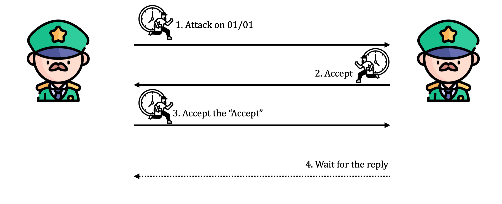
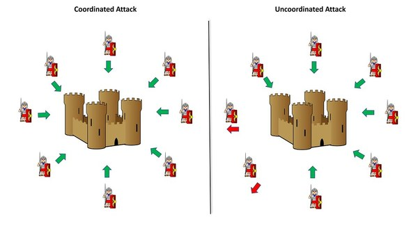

+++
date = '2024-11-15T09:47:31+07:00'
draft = false
title = 'Bài toán đồng thuận và thuật toán Raft'
summary = 'Bài toán đồng thuận là một trong những bài toán cơ bản trong lý thuyết máy tính. Bài toán này được đặt ra để giải quyết vấn đề đồng thuận trong một hệ thống phân tán. Trong bài toán này, các node trong hệ thống cần đạt được sự đồng thuận về một giá trị nào đó.'
tags = ['consensus', 'distributed system']
categories = []
+++

# Đồng thuận trong hệ thống phân tán
**Bài toán 2 đại tướng:** Có 2 vị tướng cầm các cánh quân khác nhau xung quanh thành phố mà họ dự định tấn công. Hai vị tướng chỉ có thể liên lạc thông qua lính truyền tin. Hai vị tướng cần phải thống nhất với nhau về quyết định tấn công hoặc rút lui. Do đó cần đồng thuận về một quyết định để cùng phối hợp với nhau.

Ta có một kịch bản truyền tin như sau:

- Tướng A gửi thông tin cho tướng B: “Tấn công lúc 9:00 pm ngày 17 tháng 1”. Sau khi gửi tin tướng A cần nhận được confirm của tướng B để biết chắc B đã nhận được tin và biết được giờ tấn công.
- Tướng B confirm lại: “Tôi đã nhận thông tin và đồng ý tấn công lúc 9:00 pm ngày 17 tháng 1”. Sẽ có khả năng tin nhắn của B không tới nơi, hoặc bị đánh tráo, dẫn tới A không tấn công nữa. Vì thế B cần nhận được confirm của A.
- Tướng A nhận được tin và confirm lại: “Tôi đã nhận confirm của bạn là sẽ tấn công vào lúc 9:00 pm ngày 17 tháng 1”. Sau khi gửi tin, A vẫn cần nhận thông tin confirm của B vì sẽ có khả năng B (ở step 2) không nhận được tin nhắn này, và nghi ngờ dẫn tới không tấn công. Nếu A tấn công sẽ trở thành người tấn công một mình.
- Tướng B nhận được tin và confirm lại.
Sau khi gửi tin, B lại tiếp tục cần nhận thông tin confirm của A…

Cứ thế số lần cần confirm trở thành vô cùng và cả 2 vị tướng sẽ không bao giờ đạt được đồng thuận.

**Byzantine Generals’ Problem:** Nếu ta thay đổi lại yêu cầu bài toán: từ 2 vị tướng thành N vị tướng. Tin tức lúc này có thể bị thất lạc hoặc giả mạo. Ngoài ra, trong trường hợp có những vị tướng phản bội ngăn cản các vị tướng làm theo thỏa thuận bằng cách gửi đi những thông điệp gây nhiễu. Ví dụ:
- 4 tướng muốn tấn công
- 4 tướng muốn rút quân
- Tướng phản bội nói với nhóm thứ nhất là muốn tấn công, nói với nhóm thứ 2 là muốn rút quân

Vậy các tướng trung thành làm thế nào để có thể đạt được thỏa thuận?

**Tại sao đồng thuận trong hệ thống phân tán quan trọng?**

Ngữ cảnh trên tương tự như trong hệ thống phân tán: các máy tính trong mạng là các vị tướng; người đưa thư là phương tiện truyền tải thông tin; bức thư là thông tin mà các máy tính trong mạng muốn truyền tải.

Việc gửi nhận thông tin trong hệ thống phân tán là rất khó vì tin nhắn có thể :

- Thất lạc trên đường truyền, không tới được người nhận.
- Nhận trễ với thời gian bất kì (nhận được sau 2 giây hoặc có thể sau một tiếng)
- Nhận được không đúng với thứ tự được gửi.
- Có thể bị gửi sai (byzantine) hoặc bị thay đổi nội dung trên đường truyền.
...

Tuy vậy, yêu cầu đặt ra là các máy tính trong mạng cần phải đạt được đồng thuận trên cùng một thông tin. Đồng thuận là bài toán kinh điển luôn xuất hiện trong các hệ thống phân tán do có nhiều tác nhân tham gia.

Ví dụ thực tế với hệ thống Kafka, các brokers cần phải thống nhất thông tin về controller (là broker đóng vai trò là leader trên một topic). Tại một thời điểm, nếu có nhiều hơn 2 máy cùng là controller trên một topic có thể xảy ra tình trạng dữ liệu không nhất quán.

Các hệ thống phân tán luôn có service đảm bảo đồng thuận cho toàn bộ mạng, và được coi là trái tim của toàn bộ hệ thống. Ví dụ như Kafka cũ sử dụng Zookeeper (sử dụng biến thể của thuật toán Paxos), Kafka mới sử dụng Raft hay Kubernetes sử dụng etcd (thuật toán Raft).

# Thuật toán Raft

