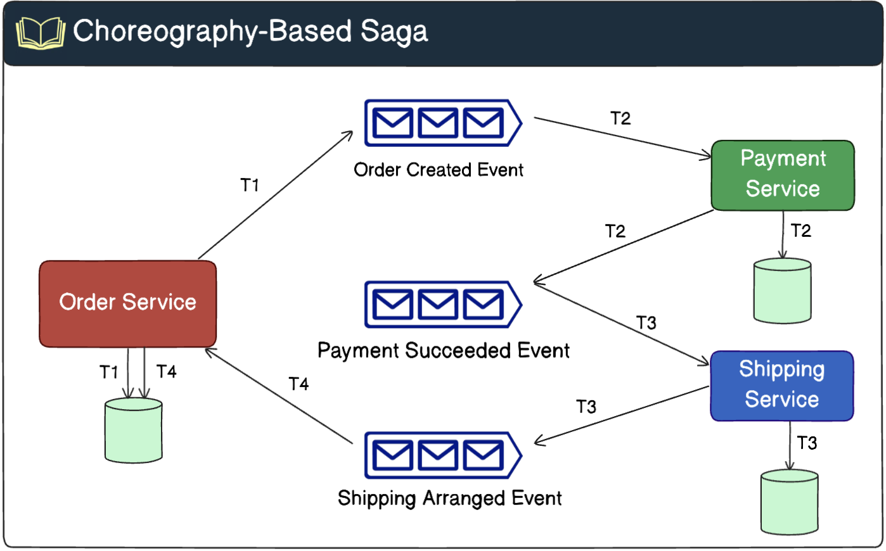
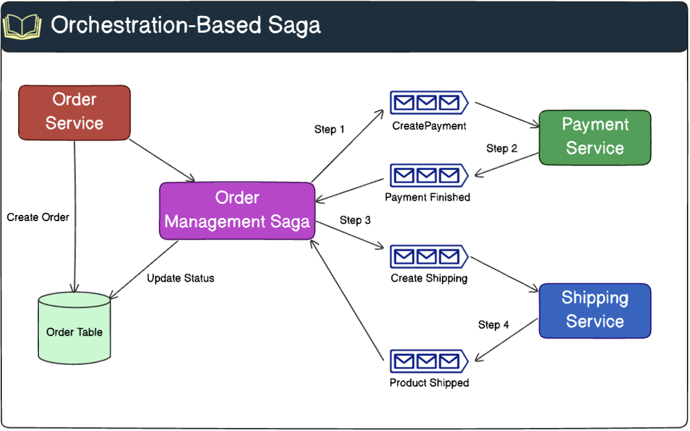

+++
date = '2023-02-01T09:47:31+07:00'
draft = false
title = 'Saga Pattern'
summary = 'Saga Pattern là một mẫu thiết kế (design pattern) dùng để quản lý giao dịch giữa nhiều service độc lập trong kiến trúc microservices'
tags = ['microservice', 'distributed transaction']
categories = []
+++

Các ứng dụng monolithic dựa vào ACID để đảm bảo tính toàn vẹn dữ liệu, nhưng khi phức tạp, hạn chế của nó trở nên rõ ràng. Microservices giải quyết nhiều vấn đề này, nhưng tạo thách thức trong quản lý transaction phân tán và duy trì tính nhất quán dữ liệu.

Mô hình SAGA cung cấp một phương pháp có cấu trúc để quản lý transaction qua nhiều microservices, xử lý phức tạp của transaction phân tán và vẫn phù hợp với nguyên tắc kết nối lỏng lẻo và triển khai độc lập của kiến trúc microservices.

## 1. Saga Pattern

Saga Pattern là một mẫu thiết kế (design pattern) dùng để quản lý các giao dịch phân tán giữa nhiều service độc lập trong kiến trúc microservices.

Trong microservices, mỗi service thường sở hữu cơ sở dữ liệu riêng, nên việc thực hiện một transaction xuyên suốt toàn hệ thống không thể áp dụng các giao dịch ACID truyền thống. Đó là lý do Saga Pattern ra đời, nhằm đảm bảo tính nhất quán dữ liệu giữa các service.

Hiểu một cách đơn giản, Saga là một chuỗi các transaction nhỏ và độc lập:
- Mỗi transaction sẽ được thực hiện trong một service riêng lẻ, sau đó trigger (kích hoạt) transaction tiếp theo.
- Nếu một transaction nào đó gặp lỗi, Saga sẽ thực hiện transaction hoàn tác (compensating transaction) để khôi phục lại dữ liệu về trạng thái ban đầu, đảm bảo hệ thống không bị sai lệch.

Có 3 thành phần chính trong mô hình Saga bạn cần biết để hiểu cách nó hoạt động:

- **Local Transactions** - Mỗi bước trong business process được thực hiện như là một local transaction trong service tương ứng của nó.
- **Compensation Transactions** - Nếu một trong những local transaction thất bại, compensation transactions được kích hoạt trong các service nơi các bước trước đó đã được thực hiện thành công. Những compensation transactions này về cơ bản là các undo operations, đảm bảo hệ thống trở về trạng thái nhất quán ban đầu.
- **Communication** - Các dịch vụ communicate với nhau thông qua các events. Điều này thường là bất đồng bộ sử dụng message queues.

## 2. Các phương pháp triển khai Saga Pattern
### 2.1 Choreography-based Saga
Trong mô hình Choreography-Based Saga, tất cả các service tham gia vào transaction phân tán sẽ emit một event mới sau khi hoàn thành các local transactions của chúng và nó sẽ kích hoạt transaction của service tiếp theo.

Trong sơ đồ kiến trúc dưới đây, saga theo mô hình choreography có ba thành phần tham gia: **order service**, **payment service**, và **shipping service**. Có bốn bước cần thực hiện để hoàn tất giao dịch: **T1, T2, T3, T4**.

- **Order Service** thực hiện một local transaction T1, trong đó vừa tạo mới đơn hàng trong database với trạng thái là **PENDING**, vừa gửi một event **Order Created** lên message broker.
- **Payment Service** subscribe các event từ **Order Service** và nhận được event **Order Created**. Nó thực hiện một local transaction T2, vừa update database với thông tin thanh toán, vừa gửi một event **Payment Succeeded** lên message broker.
- **Shipping Service** subscribe các event từ **Payment Service** và nhận được event **Payment Succeeded**. Nó thực hiện một local transaction T3, vừa update database với thông tin shipping, vừa gửi một event **Shipping Arranged** lên message broker.
- **Order Service** subscribe các event từ **Shipping Service** và nhận được event **Shipping Arranged** sau đó update trạng thái của đơn hàng thành **COMPLETED** trong database với local transaction T4.

Trong trường hợp tạo shipping thất bại, quy trình sẽ được hoàn tác như sau:

- Nếu tạo shipping thất bại, **Shipping Service** sẽ thực hiện hoàn tác thông tin shipping trong database và gửi một event **Shipping failed** lên message broker.
- **Payment Service** subscribe các event từ **Shipping Service** và nhận được event **Shipping failed**. Nó thực hiện hoàn tác thanh toán trong database và gửi một event **Payment reverted** lên message broker.
- **Order Service** subscribe các event từ **Payment Service** và nhận được event **Payment reverted**. Nó thực hiện update trạng thái của đơn hàng trong database thành **cancelled**.

Ưu điểm:
- Phù hợp cho các quy trình làm việc đơn giản yêu cầu ít bên tham gia và không cần logic điều phối.
- Không đòi hỏi triển khai và bảo trì dịch vụ bổ sung.
- Trách nhiệm được phân phối qua các bên tham gia của Saga, do đó không sinh ra point of failure.

Nhược điểm:
- Quy trình làm việc có thể trở nên rối hơn khi thêm các step mới, đồng thời khó theo dõi được service nào của Saga đang lắng nghe sự kiện nào nào.
- Có rủi ro về cyclic dependencies giữa các bên tham gia của Saga vì chúng phải consume các message của nhau.
- Quy trình Kiểm thử tích hợp khó khăn vì tất cả các service phải đang thực hiện để mô phỏng một transaction.
- Ngoài ra việc các business logic phân tán ở nhiều chỗ khiến việc hiểu toàn bộ flow trở nên khó khăn hơn.

### 2.2 Orchestration-based Saga
Trong Saga dựa trên Orchestration, orchestrator đóng vai trò như một nhạc trưởng, điều khiển và phối hợp các bước khác nhau trong saga.

Orchestrator định nghĩa rõ ràng workflow của Saga, chỉ ra trình tự các bước và các quan hệ phụ thuộc giữa chúng. Cách tiếp cận tập trung này giúp việc hình dung và lý giải toàn bộ quy trình trở nên dễ dàng hơn, bởi toàn bộ logic được đóng gói trong orchestrator.

- Orchestrator sẽ bắt đầu bằng việc kích hoạt bước đặt đơn hàng.
- Khi đơn hàng đã được đặt, orchestrator sẽ tiến hành xác thực thông tin đơn hàng. Nếu bước xác thực thành công, orchestrator sẽ khởi chạy bước xử lý thanh toán.
- Cuối cùng, orchestrator sẽ kích hoạt bước giao hàng để đưa sản phẩm tới khách hàng.
- Nếu bất kỳ bước nào trong saga thất bại, orchestrator sẽ xử lý lỗi và kích hoạt các hành động bù trừ để hoàn tác những bước trước đó, nhằm duy trì tính nhất quán của dữ liệu.

Ưu điểm:
- Phù hợp cho các quy trình làm việc phức tạp liên quan đến nhiều service cùng tham gia.
- Thích hợp khi có kiểm soát đối với từng service tham gia trong quy trình và kiểm soát đối với luồng hoạt động.
- Không tạo ra cyclic dependencies, vì orchestrator phụ thuộc một chiều vào các service tham gia của Saga.
- Các service tham gia không cần biết về các xử lý cũng như event của các service tham gia khác. Sự phân chia rõ ràng về mặt quan tâm giúp đơn giản hóa business logic.

Nhược điểm:
- Phức tạp hóa thiết kế, yêu cầu triển khai thêm một logic orchestration.
- Có một **point of failure** bổ sung, vì orchestrator quản lý toàn bộ quy trình làm việc. Nếu orchestrator gặp sự cố thì toàn bộ quy trình đều ngừng hoạt động.
- Bottle neck/Letancy: khi số lượng services trong qua trình xử lý tăng lên cao thì rất dễ bottle neck.
- Design hệ thống không cẩn thận cũng rất dễ dính vào cái bẫy **distributed monolithic application**.

## 3. Kết luận
**Saga Pattern** là một giải pháp hiệu quả để quản lý các giao dịch phân tán trong kiến trúc microservices. Với hai cách triển khai chính - **Choreography** và **Orchestration**, pattern này mang đến sự linh hoạt trong việc xử lý các quy trình nghiệp vụ phức tạp, đồng thời đảm bảo dữ liệu luôn nhất quán.

Mặc dù phức tạp hơn so với các giao dịch ACID truyền thống, **Saga Pattern** lại giúp hệ thống phân tán hiện đại trở nên mạnh mẽ hơn nhờ khả năng mở rộng tốt, sẵn sàng cao, và chống chịu lỗi hiệu quả.