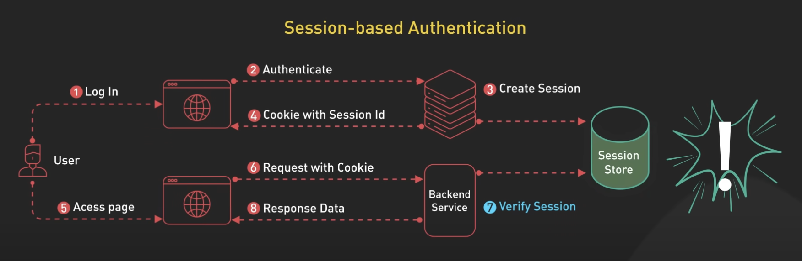
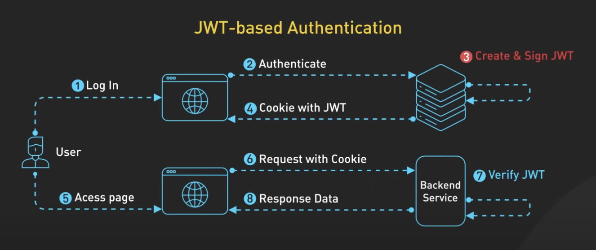
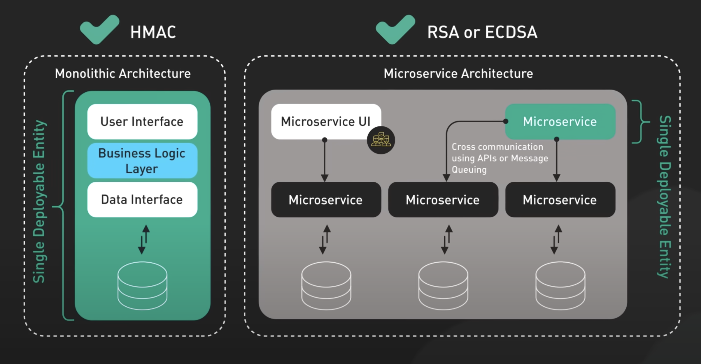

+++
date = '2020-02-01T09:47:31+07:00'
draft = false
title = 'Session vs Jwt'
summary = 'Session-based authentication vs JSON Web Tokens (JWTs)'
tags = ['authentication']
categories = []
+++

## 1. Session-based authentication

1. Người dùng gửi thông tin đăng nhập của họ đến server.
2. Server xác minh thông tin đăng nhập này. Nếu hợp lệ, nó sẽ tạo một session mới.
3. Server lưu trữ dữ liệu session, thường là trong database hoặc bộ nhớ đệm như Redis. Dữ liệu này có thể bao gồm ID người dùng, thời gian hết hạn của session và các thông tin khác.
4. Server sau đó phản hồi với một session ID duy nhất, thường được gửi dưới dạng cookie.
5. 
6. Trong các yêu cầu tiếp theo, trình duyệt sẽ tự động gửi cookie chứa session ID đó kèm theo mỗi yêu cầu.
7. Server nhận session ID, tra cứu dữ liệu session tương ứng trong session storage và sử dụng dữ liệu này để xác thực và xử lý yêu cầu.

Điểm quan trọng ở đây là **server chịu trách nhiệm tạo và lưu trữ dữ liệu session**, sau đó sử dụng session ID để truy xuất dữ liệu đó trong các yêu cầu sau này.

Một lợi thế của session là có thể **thu hồi (revoke) ngay lập tức**. Vì dữ liệu session được lưu trên server, chỉ cần xóa hoặc vô hiệu hóa session đó là người dùng bị đăng xuất. Tuy nhiên, trong một hệ thống phân tán, nơi ứng dụng chạy trên nhiều server, tất cả các server phải có quyền truy cập vào cùng một dữ liệu session. Điều này thường được thực hiện bằng cách sử dụng session storage tập trung như Redis hoặc database SQL phân tán.

Mặc dù cách này hoạt động tốt, nhưng nó làm tăng độ phức tạp và có thể gây ra độ trễ do mỗi yêu cầu phải thực hiện một truy vấn đến session storage.



## 2. Authentication using JWT

1. Người dùng gửi thông tin đăng nhập của họ đến server.
2. Server xác minh thông tin đăng nhập.
3. Nếu hợp lệ, nó sẽ tạo một JWT. Server ký JWT bằng một khóa bí mật. Chữ ký này đảm bảo tính toàn vẹn của token, ngăn chặn việc bị chỉnh sửa.
4. Sau đó, server gửi lại JWT cho client, thường là trong phần thân phản hồi. Client lưu trữ JWT, thường trong **local storage** hoặc **cookie**.
5. 
6. Trong các yêu cầu tiếp theo, client gửi JWT trong header của yêu cầu.
7. Server xác minh chữ ký của JWT. Nếu hợp lệ, server tin tưởng dữ liệu trong token và sử dụng nó để xác thực và ủy quyền.

Sự khác biệt quan trọng ở đây là **server không lưu trữ trạng thái session**. Tất cả thông tin cần thiết đã được mã hóa trong token và được lưu trên client. Điều này làm cho JWT trở thành **một phương pháp xác thực không trạng thái (stateless)**.

Để ký JWT, có nhiều thuật toán khác nhau, trong đó phổ biến nhất là **HMAC, RSA và ECDSA**:

- **HMAC** là phương pháp ký đối xứng (symmetric), nghĩa là cùng một khóa bí mật được dùng để ký và xác minh token. Cách này đơn giản và hiệu quả, nhưng yêu cầu chia sẻ khóa bí mật giữa các service cần xác minh token, điều này có thể là một vấn đề bảo mật.
- **RSA và ECDSA** là các phương pháp ký bất đối xứng (asymmetric), sử dụng **khóa riêng (private key)** để ký token và **khóa công khai (public key)** để xác minh. Điều này giúp bảo mật tốt hơn vì khóa riêng luôn được giữ bí mật và chỉ dùng để ký, trong khi bất kỳ service nào cũng có thể xác minh token bằng khóa công khai. Tuy nhiên, cách này phức tạp hơn và có chi phí tính toán cao hơn so với HMAC.

Lựa chọn thuật toán ký phụ thuộc vào yêu cầu bảo mật và kiến trúc hệ thống của bạn. Nếu ứng dụng của bạn là monolithic hoặc tất cả các service đều đáng tin cậy, HMAC có thể là đủ. Nhưng nếu bạn có kiến trúc microservices hoặc cần chia sẻ JWT với bên thứ ba không đáng tin cậy, RSA hoặc ECDSA sẽ an toàn hơn.

Một thách thức khi sử dụng JWT là xử lý thời gian hết hạn của token. Nếu token bị đánh cắp, kẻ tấn công có thể sử dụng nó cho đến khi hết hạn. Để giảm thiểu rủi ro này, có thể sử dụng refresh token kết hợp với access token ngắn hạn.

- **Access token** là JWT thực sự được sử dụng để xác thực mỗi yêu cầu và có **thời gian hết hạn ngắn** (thường khoảng 15 phút).
- **Refresh token** có **thời gian hết hạn dài hơn** (có thể là vài ngày hoặc vài tuần). Khi access token hết hạn, thay vì yêu cầu người dùng đăng nhập lại, client sẽ gửi refresh token đến một endpoint đặc biệt trên server. Server kiểm tra refresh token có hợp lệ và chưa bị thu hồi hay không. Nếu hợp lệ, server phát hành một access token mới mà không cần người dùng can thiệp.
Refresh token giúp **cân bằng giữa bảo mật và trải nghiệm người dùng**. Access token ngắn hạn giới hạn thời gian kẻ tấn công có thể sử dụng token bị đánh cắp, trong khi refresh token giúp người dùng duy trì đăng nhập lâu dài mà không cần đăng nhập lại liên tục.

Điều quan trọng là **refresh token chỉ được gửi khi access token hết hạn**, không phải trong mỗi yêu cầu. Trong khi đó, **access token sẽ được gửi trong tất cả các yêu cầu yêu cầu xác thực**.



## 3. Khi nào nên dùng xác thực bằng session và khi nào nên dùng JWT?
- **Session-based authentication** phù hợp khi bạn cần **thu hồi session ngay lập tức**. Ví dụ, nếu người dùng báo cáo tài khoản bị xâm nhập, bạn có thể vô hiệu hóa session của họ ngay lập tức.
- Nếu bạn đã có database tập trung để lưu trữ dữ liệu khác, bạn có thể tận dụng nó để lưu session, tránh phải triển khai thêm hệ thống lưu trữ khác. Tuy nhiên, việc lưu trữ session trên server làm **tăng độ trễ** do cần truy vấn session storage trong mỗi yêu cầu.
- Xác thực bằng session cũng giúp **giữ thông tin nhạy cảm trên server**, điều này có thể mang lại lợi thế bảo mật.
- Xác thực bằng JWT phù hợp khi bạn cần một kiến trúc **không trạng thái (stateless)**. Vì JWT chứa tất cả thông tin cần thiết, server không cần lưu trữ trạng thái session, giúp **dễ dàng mở rộng hệ thống theo chiều ngang**.
- JWT cũng hữu ích khi bạn cần **chia sẻ dữ liệu xác thực với các service khác**. Trong kiến trúc microservices, một JWT do authentication service phát hành có thể được các service khác tin tưởng mà không cần liên hệ lại với authentication service.
- Nếu sử dụng JWT, bạn nên kết hợp refresh token để **cân bằng giữa bảo mật và trải nghiệm người dùng**. Refresh token giúp duy trì xác thực lâu dài mà vẫn giữ thời gian sống của access token ở mức ngắn để giảm rủi ro nếu bị đánh cắp.

Cuối cùng, lựa chọn giữa Session-based authentication và JWT phụ thuộc vào nhu cầu cụ thể và kiến trúc của ứng dụng của bạn.