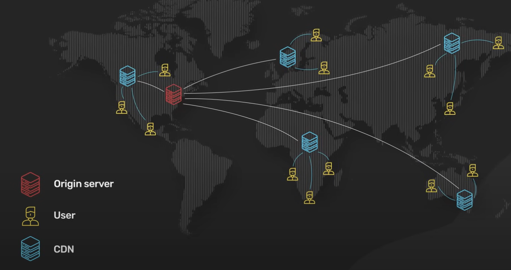

+++
date = '2023-11-15T09:47:31+07:00'
draft = false
title = 'What Is A CDN? How Does It Work?'
summary = 'CDN, hay mạng phân phối nội dung (Content Delivery Network), đã xuất hiện từ cuối những năm 90. Ban đầu, nó được phát triển để tăng tốc việc phân phối nội dung HTML tĩnh cho người dùng trên toàn thế giới.'
tags = ['cdn']
categories = []
+++

## Giới thiệu

CDN là gì? Tại sao chúng ta - những nhà phát triển nên tận dụng nó? Hãy cùng tìm hiểu.

## CDN là gì?

CDN, hay mạng phân phối nội dung (Content Delivery Network), đã xuất hiện từ cuối những năm 90. Ban đầu, nó được phát triển để tăng tốc việc phân phối nội dung HTML tĩnh cho người dùng trên toàn thế giới.

CDN đã phát triển qua nhiều thập kỷ. Ngày nay, CDN nên được sử dụng bất cứ khi nào lưu lượng HTTP được phục vụ.

## Cách thức hoạt động của CDN

### Nguyên lý cơ bản

Ở cấp độ cơ bản, CDN đưa nội dung đến gần người dùng hơn. Điều này cải thiện hiệu suất của dịch vụ web theo cảm nhận của người dùng. Đã có nhiều tài liệu chứng minh rằng hiệu suất là yếu tố quan trọng đối với sự tương tác và giữ chân người dùng.

### Mạng lưới các điểm hiện diện (PoP)

Để đưa dịch vụ đến gần người dùng hơn, CDN triển khai máy chủ tại hàng trăm địa điểm trên toàn thế giới. Các vị trí máy chủ này được gọi là Điểm hiện diện (Point of Presence), hay PoP. Một máy chủ bên trong PoP hiện nay thường được gọi là máy chủ biên (edge server). Việc có nhiều PoP trên toàn thế giới đảm bảo rằng mọi người dùng đều có thể kết nối với một máy chủ biên nhanh chóng gần họ.

### Công nghệ định tuyến

Các CDN khác nhau sử dụng các công nghệ khác nhau để định hướng yêu cầu của người dùng đến PoP gần nhất. Hai công nghệ phổ biến là định tuyến dựa trên DNS và Anycast.

- **Định tuyến dựa trên DNS**: Mỗi PoP có địa chỉ IP riêng. Khi người dùng tra cứu địa chỉ IP cho CDN, DNS trả về địa chỉ IP của PoP gần họ nhất.

- **Anycast**: Tất cả các PoP chia sẻ cùng một địa chỉ IP. Khi một yêu cầu đi vào mạng Anycast cho địa chỉ IP đó, mạng sẽ gửi yêu cầu đến PoP gần nhất với người yêu cầu.


### Bộ nhớ đệm và proxy ngược

Mỗi máy chủ biên hoạt động như một proxy ngược với bộ nhớ đệm nội dung khổng lồ. Nội dung tĩnh được lưu trong bộ nhớ đệm trên máy chủ biên. Nếu một phần nội dung đã có trong bộ nhớ đệm, nó có thể được trả về nhanh chóng cho người dùng.

Vì máy chủ biên chỉ yêu cầu một bản sao của nội dung tĩnh từ máy chủ gốc nếu nó không có trong bộ nhớ đệm, điều này giảm đáng kể tải và yêu cầu băng thông của cụm máy chủ gốc.

### Tối ưu hóa nội dung

Một CDN hiện đại cũng có thể chuyển đổi nội dung tĩnh thành các định dạng tối ưu hơn. Ví dụ, nó có thể thu nhỏ các gói JavaScript ngay lập tức, hoặc chuyển đổi một tệp hình ảnh từ định dạng cũ sang định dạng hiện đại như WebP hoặc AVIF.

### Kết thúc kết nối TLS

Máy chủ biên cũng đóng vai trò rất quan trọng trong ngăn xếp HTTP hiện đại. Tất cả các kết nối TLS kết thúc tại máy chủ biên. Bắt tay TLS tốn nhiều tài nguyên. Các phiên bản TLS thường được sử dụng như TLS 1.2 cần một vài vòng đi về mạng để thiết lập.

Bằng cách kết thúc kết nối TLS tại biên, nó giảm đáng kể độ trễ để người dùng thiết lập kết nối TCP được mã hóa. Đây là một lý do tại sao nhiều ứng dụng hiện đại gửi ngay cả nội dung HTTP động không thể lưu vào bộ nhớ đệm qua CDN.

## Lợi ích chính của CDN

Ngoài hiệu suất, một CDN hiện đại mang lại hai lợi ích chính khác:

### 1. Bảo mật

Tất cả các CDN hiện đại đều có dung lượng mạng khổng lồ ở biên. Đây là chìa khóa để cung cấp khả năng bảo vệ DDoS hiệu quả chống lại các cuộc tấn công quy mô lớn - bằng cách có mạng với dung lượng lớn hơn nhiều so với kẻ tấn công.

Điều này đặc biệt hiệu quả với CDN được xây dựng trên mạng Anycast. Nó cho phép CDN phân tán lưu lượng tấn công trên một số lượng lớn máy chủ.

### 2. Tính khả dụng

Một CDN hiện đại cải thiện tính khả dụng. Một CDN về bản chất là phân tán cao. Bằng cách có các bản sao của nội dung có sẵn trong nhiều PoP, CDN có thể chịu đựng nhiều lỗi phần cứng hơn so với các máy chủ gốc.


## Khi nào nên sử dụng CDN?

Một CDN hiện đại mang lại nhiều lợi ích. Nếu chúng ta đang phục vụ lưu lượng HTTP, chúng ta nên sử dụng CDN.

## Kết luận

CDN là một công nghệ quan trọng đã phát triển từ cuối những năm 90 đến nay. Từ việc chỉ phục vụ nội dung HTML tĩnh, CDN hiện đại đã trở thành một thành phần thiết yếu trong cơ sở hạ tầng web, mang lại nhiều lợi ích về hiệu suất, bảo mật và tính khả dụng.
